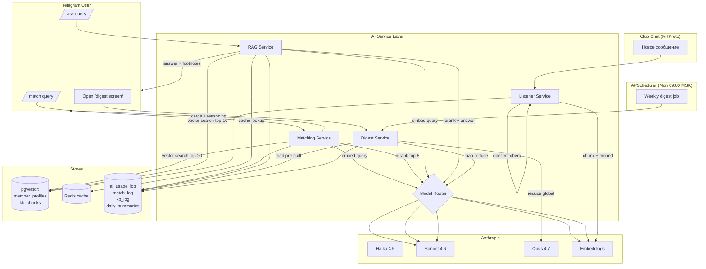

# AI-архитектура «Клуба 33»

## 1. Контекст и цели

AI-подсистема «Клуба 33» отвечает за четыре пользовательских сервиса в Phase 2:

1. **Matching** (`/match`) — подбор участников клуба по запросу с reasoning и feedback-loop (Lunchclub-pattern).
2. **Knowledge Base / RAG** (`/ask`) — ответы на вопросы из чата клуба с цитатами источников (Perplexity-pattern).
3. **Digest** (`/digest`) — еженедельный обзор активности клуба.
4. **Listener** — фоновый индексер сообщений чата клуба (с явного согласия в «законе клуба»).

Ключевые ограничения (DEC-008, метрики Analytics):
- AI-провайдер — **только Anthropic** (Claude API).
- Стоимость AI ≤ **$2/user/мес** (Cost per User per Month, метрика Analytics).
- `/match` p95 latency ≤ **5 сек**, `/ask` p95 ≤ **8 сек**.
- Защита от prompt-injection обязательна на всех слоях (Security TASK-010).

## 2. Стек

| Слой | Технология | Назначение |
|------|------------|------------|
| LLM-провайдер | Anthropic API (Haiku 4.5, Sonnet 4.6, Opus 4.7) | Reasoning, rerank, генерация |
| Embeddings | voyage-3 (1536d) **или** Anthropic embeddings *(TBD)* | Векторизация запросов и контента |
| SDK | `anthropic` (Python) | Основной клиент |
| RAG-orchestration | LangChain (опционально, для /ask) | Retrieval + Citation chain |
| Vector store | PostgreSQL 16 + pgvector (1536 dim, HNSW index) | Хранение embeddings: `member_profiles`, `kb_chunks` |
| Cache | Redis 7 | Кэш не-персональных запросов (KB top-10), session-context |
| Scheduler | APScheduler | Cron для digest, индексации |
| Bot/Listener | Python (aiogram + MTProto через Telethon) | Получение сообщений чата |
| Logging | `ai_usage_log` (PG) + AuditLog | Cost tracking + аудит |

### Решение по embedding-провайдеру (TBD → Phase 5 Architect)

| Опция | Pros | Cons | Решение |
|-------|------|------|---------|
| **voyage-3** (1024d, или voyage-3-large 1536d) | Высокое качество retrieval, отдельный billing | Внешний провайдер, ещё одна интеграция | **Recommended** — лучшая retrieval-quality для RU/EN |
| Anthropic embeddings (если будут публично доступны на момент Phase 5) | Один провайдер | Может не существовать как продукт | Альтернатива; решает Architect Agent |

> До финального решения архитектура рассчитана на абстракцию `EmbeddingProvider` с одной реализацией на старте.

## 3. Архитектурные слои AI

```
┌──────────────────────────────────────────────────────────────────────┐
│  Presentation (Bot + Mini-app)                                       │
│  - /match form, /match results, feedback кнопки                      │
│  - /ask form, /ask answer + footnotes                                │
│  - /digest экран                                                     │
└────────────────────────────────┬─────────────────────────────────────┘
                                 │ REST API (Django + DRF)
┌────────────────────────────────▼─────────────────────────────────────┐
│  Application (AI Service Layer)                                      │
│  ┌────────────┐  ┌────────────┐  ┌────────────┐  ┌────────────┐     │
│  │ Matching   │  │ KB / RAG   │  │ Digest     │  │ Listener   │     │
│  │ Service    │  │ Service    │  │ Service    │  │ Service    │     │
│  └─────┬──────┘  └─────┬──────┘  └─────┬──────┘  └─────┬──────┘     │
│        │               │               │               │             │
│        └───────────────┴───────┬───────┴───────────────┘             │
│                                ▼                                     │
│                    ┌───────────────────────┐                         │
│                    │ Model Router          │  (DEC-008)              │
│                    │ + Cost Tracker        │                         │
│                    └─────┬────────────┬────┘                         │
└──────────────────────────┼────────────┼──────────────────────────────┘
                           │            │
                ┌──────────▼─┐  ┌───────▼──────────┐
                │ Anthropic  │  │ Embeddings       │
                │ Claude API │  │ Provider         │
                └──────────┬─┘  └───────┬──────────┘
                           │            │
┌──────────────────────────▼────────────▼──────────────────────────────┐
│  Infrastructure                                                      │
│  ┌──────────────┐  ┌──────────────┐  ┌──────────────┐                │
│  │ PostgreSQL   │  │ Redis 7      │  │ ai_usage_log │                │
│  │ + pgvector   │  │ (cache, RL)  │  │ (PG)         │                │
│  │ - profiles   │  └──────────────┘  └──────────────┘                │
│  │ - kb_chunks  │                                                    │
│  │ - match_log  │                                                    │
│  │ - kb_log     │                                                    │
│  └──────────────┘                                                    │
└──────────────────────────────────────────────────────────────────────┘
```

## 4. Диаграмма потоков данных (Mermaid)



## 5. Async pipeline

Все AI-операции — **асинхронные** на стороне backend (Django + Celery-like background task через APScheduler/Q), чтобы не блокировать HTTP-handler:

```
HTTP request (bot/mini-app)
   ↓
Validate + rate-limit (Redis token bucket per user)
   ↓
Cost-cap check (user $2/mo, feature daily cap)
   ↓
Cache lookup (только для не-персональных запросов)
   ↓ miss
Model Router → execute (Anthropic call)
   ↓
Log to ai_usage_log (model, tokens, cost_usd)
   ↓
Cache write (TTL-based)
   ↓
Response → client
```

## 6. Стратегия кэширования

| Сервис | Кэшируем? | Ключ | TTL | Хранилище |
|--------|-----------|------|-----|-----------|
| Matching (rerank результат) | **НЕТ** | — | — | результат персонализирован под query+user |
| Matching (query embedding) | Да | `hash(query)` | 1 час | Redis |
| KB query embedding | Да | `hash(query)` | 24 часа | Redis |
| KB answer (только если query identical) | Да (нормализованный) | `hash(normalized_query)` | 6 часов | Redis |
| KB chunks retrieval | Косвенно через pgvector | — | persistent | PostgreSQL |
| Digest (готовый weekly) | Да | `week_iso` | до следующего понедельника | PostgreSQL `daily_summaries` |

> Персональный матчинг **не кэшируем** — каждый rerank уникален под пару (query, user_id, current member pool state).

## 7. Cost-модель (оценка)

| Сервис | Per-request cost | Frequency / 100 users / month | Total / 100 users / month |
|--------|------------------|-------------------------------|---------------------------|
| `/match` | ≤ $0.05 | ~6 (avg) | $30 |
| `/ask` | ≤ $0.08 | ~10 (avg) | $80 |
| `/digest` | ~$0.50/week (global) | 4 раза | $2 |
| Listener (индексация) | ~$0.005 / 100 сообщений | ~1500 сообщений/мес | $0.75 |
| **Итого** | | | **≈$113 / 100 users / мес = $1.13/user** |

Резерв 40% от $2 cap → запас на пики, повторные запросы, debug-runs.

## 8. Безопасность (cross-cut)

- **Prompt-injection**: все системные промпты содержат явную инструкцию игнорировать инструкции из user-input/контекста (см. `prompts-library.md`).
- **PII в логах**: `ai_usage_log` хранит только агрегаты (tokens, cost), не сам текст. Текст запросов опционально хешируется или хранится с retention 30 дней в `match_log/kb_log` для аналитики.
- **Listener consent**: индексируем сообщения **только** авторов, у которых `user.consents.law_of_club = true`.
- **Rate-limit**: per user — 10 match/час, 20 ask/час; глобально на feature — daily cap (см. `cost-tracking.md`).

## 9. Связь с другими подсистемами

| Подсистема | Связь |
|------------|-------|
| Data (TASK-009) | Таблицы `member_profiles`, `kb_chunks`, `chat_messages`, `match_log`, `kb_log`, `daily_summaries`, `ai_usage_log` |
| Security (TASK-010) | Prompt-injection защита, consent-flag, rate-limit, secrets |
| Architect (TASK-008) | ADR-AI-001 (provider lock-in), ADR-AI-002 (embedding choice) |
| Analytics | События `match_*`, `kb_*`, `digest_*`, cost-метрики |

## 10. Файлы подсистемы (этот пакет)

- `ai-architecture.md` — этот файл, обзорная архитектура.
- `matching-system.md` — детали `/match` pipeline.
- `rag-system.md` — детали `/ask` pipeline + Listener.
- `digest-system.md` — еженедельный digest.
- `model-router.md` — правила выбора моделей.
- `cost-tracking.md` — `ai_usage_log`, дашборды, alerts.
- `prompts-library.md` — системные промпты с защитой.

---
*Документ создан: AI-Agents Agent | Дата: 2026-05-16*
