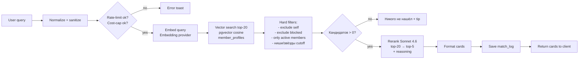

# Matching System (`/match`)

Подбор участников клуба по запросу с reasoning и feedback-loop. UX-референс — Lunchclub (DEC-R-002). Метрики — Match Requests, Match CTR ≥15%, Match Quality ≥60%.

## 1. Pipeline (синхронный path, ≤5 сек p95)



### Шаги детально

| # | Шаг | Модель | Latency target | Cost оценка |
|---|-----|--------|----------------|-------------|
| 1 | Normalize | — | <50ms | $0 |
| 2 | Embed query | voyage-3 / Anthropic emb | <200ms | ~$0.00002 |
| 3 | pgvector search top-20 | — | <100ms | $0 |
| 4 | Hard filters (SQL) | — | <50ms | $0 |
| 5 | Rerank top-20 → top-5 + reasoning | **Sonnet 4.6** | ~2-3s | ~$0.04 |
| 6 | Format + log | — | <50ms | $0 |
| **Σ** | | | **~3 сек** | **~$0.04-0.05** |

## 2. Подготовка `member_profiles.embedding`

Embedding профиля строится из конкатенации полей:

```
[Имя] {name}
[Роль/ниша] {role.name}: {role.description}
[Bio] {profile.bio}
[Компетенции] {profile.competences}
[Города] {profile.cities}
[Звёзды] {stars}/4
```

- Пересчитывается при каждом изменении `bio/role/competences` (триггер на save).
- Пересчёт раз в 30 дней (cron) на случай дрейфа embedding-модели.
- Размерность — 1536 (HNSW index, `vector_cosine_ops`).

## 3. Hard filters (SQL)

```sql
WHERE user.id != :requester_id
  AND user.status = 'active'
  AND user.is_blocked = false
  AND user.subscription_active_until > NOW()
  AND user.id NOT IN (
    SELECT blocked_user_id FROM user_blocks WHERE blocker_id = :requester_id
  )
  -- soft признаки идут в rerank-промпт, не в SQL
```

## 4. Rerank prompt

См. `prompts-library.md` → `MATCH_RERANK_PROMPT`. Получает:
- `query` — нормализованный запрос пользователя
- `candidates[]` — 20 объектов с обезличенным id + текст профиля (без telegram username)
- Output schema (JSON):

```json
{
  "matches": [
    {
      "candidate_id": "u_abc123",
      "score": 92,
      "reasoning": "1-2 строки на «ты», по-русски, почему подходит"
    }
  ]
}
```

Top-5 по `score`, отсечение `< 50`. Если меньше 3 пройдут — показываем «нашли немного, попробуй уточнить запрос».

## 5. Карточка результата (соответствует `wireframes-miniapp.md` §6)

```
┌────────────────────────────────┐
│ ⭐⭐⭐⭐ Аня · Product / FinTech │
│ Москва · ★★★☆                 │
│                                │
│ Поможет с unit-экономикой —    │
│ запускала B2B-продукт 3 раза.  │
│                                │
│ [Написать в TG]                │
└────────────────────────────────┘
[👍 полезно] [😐 нейтрально] [👎 мимо]
```

Источники полей:
- avatar, name, role — из `users + roles`
- stars — `member_stars.current_score`
- reasoning — из rerank-output (`reasoning`)
- CTA → Telegram deep-link `tg://user?id={telegram_id}` (или username)

## 6. Feedback loop (DEC-UX-005)

Три кнопки сразу под карточками: **полезно / нейтрально / мимо** + дополнительный follow-up через 1 час (push в бот, см. wireframes-miniapp §6.3).

```python
# Сохраняем в match_feedback
{
  "match_log_id": ...,
  "candidate_id": ...,
  "verdict": "useful" | "neutral" | "miss",
  "created_at": ...,
  "follow_up": null | "useful" | "neutral" | "miss"
}
```

Использование feedback:
- **Сразу** — метрики `match_quality` (Analytics), CTR.
- **Постепенно** — training pairs `(query, profile, label)` → дальнейшая RLHF или supervised fine-tune (Phase 4+).
- **Алгоритмически** — кандидаты с verdict=miss от **того же** запросителя получают penalty в weight rerank на 30 дней.

## 7. `match_log` структура

```yaml
match_log:
  id: bigserial
  requester_id: FK users
  query_text: text (нормализованный)
  query_hash: char(64) (SHA-256, для аналитики без PII)
  candidates_retrieved: jsonb     # [u_abc, u_def, ...] до rerank
  candidates_returned: jsonb      # top-5 после rerank
  rerank_reasoning: jsonb         # массив reasoning от LLM
  embedding_model: varchar
  rerank_model: varchar           # 'claude-sonnet-4-6'
  tokens_in: int
  tokens_out: int
  cost_usd: decimal(10,6)
  latency_ms: int
  created_at: timestamptz
```

Retention `query_text`: 90 дней (Privacy). После — только `query_hash` + агрегаты.

## 8. Cost-бюджет

- **Target per match**: ≤ $0.05
- **Daily cap (feature)**: $50/день. Если превышен → soft-warn в админ-чат, hard-block при $75.
- **Per user**: учитывается в общем $2/мес.

## 9. Latency-оптимизации

- pgvector HNSW index (m=16, ef_construction=64, ef_search=40) — search <100ms на 10k профилей.
- Параллельный preload candidate-данных пока идёт rerank — нет, rerank блокирующий.
- Streaming Sonnet ответа — `stream=True`, первые карточки доступны через ~1.5s (typewriter в UI, см. wireframes §6).

## 10. Failure modes

| Сценарий | Поведение |
|----------|-----------|
| Anthropic API down | Fallback на Haiku rerank с предупреждением «упрощённый матчинг» + SRE alert |
| Embeddings provider down | Cached query embedding **или** ошибка «попробуй позже» |
| pgvector timeout | Retry 1×, потом ошибка |
| Cost-cap превышен пользователем | Понятная карточка «достигнут лимит AI на месяц» |

---
*Документ создан: AI-Agents Agent | Дата: 2026-05-16*
