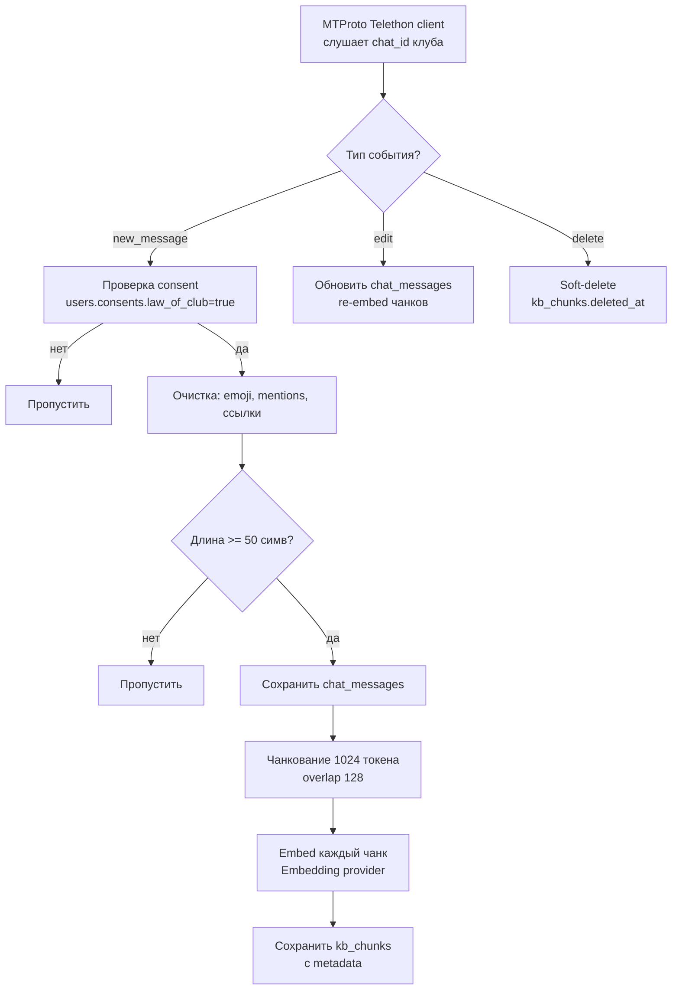
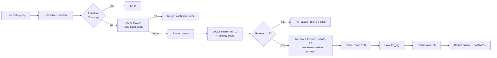

# RAG System (`/ask`) + Listener

Ответы на вопросы из базы знаний клуба с указанием источников. UX-референс — Perplexity (DEC-R-003). Метрики — KB Queries, KB Recall ≥70%, KB Coverage ≥90%, KB Latency p95 <5s.

## 1. Listener — индексация чата клуба

### Поток



### Consent-логика (критично)

```python
# Псевдокод
def should_index(message):
    user = User.objects.get(telegram_id=message.from_id)
    if not user.consents.law_of_club:
        return False
    if user.is_blocked or user.status != 'active':
        return False
    if message.is_service:        # вход/выход и т.п.
        return False
    return True
```

### Чанкование

- Размер: **1024 токена** (cl100k_base токенизатор).
- Overlap: **128 токенов**.
- Сообщения <1024 токенов → 1 чанк.
- Несколько подряд сообщений одного автора в течение 2 минут → склеиваются в одно семантическое сообщение перед чанкованием.

### `kb_chunks` структура

```yaml
kb_chunks:
  id: bigserial
  chat_message_id: FK chat_messages
  chunk_idx: int
  content: text
  embedding: vector(1536)
  author_id: FK users
  source_chat_id: bigint
  source_message_id: bigint   # для deep-link tg://privatepost/?...
  channel_or_chat: enum (chat|channel|topic)
  topic_id: bigint nullable
  created_at: timestamptz     # = время оригинального сообщения
  indexed_at: timestamptz
  deleted_at: timestamptz nullable
```

HNSW индекс по `embedding`, обычный b-tree на `created_at` для recency boost.

## 2. RAG pipeline (`/ask`)



### Recency boost

```sql
SELECT *,
  1 - (embedding <=> :query_emb)  AS sim,
  -- boost: за последние 90 дней даём множитель 1.2, за 30 — 1.4
  CASE
    WHEN created_at > NOW() - INTERVAL '30 days' THEN 1.4
    WHEN created_at > NOW() - INTERVAL '90 days' THEN 1.2
    ELSE 1.0
  END AS recency_mult,
  (1 - (embedding <=> :query_emb)) *
    CASE
      WHEN created_at > NOW() - INTERVAL '30 days' THEN 1.4
      WHEN created_at > NOW() - INTERVAL '90 days' THEN 1.2
      ELSE 1.0
    END AS final_score
FROM kb_chunks
WHERE deleted_at IS NULL
ORDER BY final_score DESC
LIMIT 10;
```

### Answer prompt

См. `prompts-library.md` → `KB_ANSWER_PROMPT`. Получает:
- `query` — нормализованный запрос
- `context_chunks[]` — 10 объектов `{id, author_display, date, text}` (без telegram username)
- Output: текст ответа на «ты», ≤300 слов, с inline-цитатами `[1]`, `[2]` соответствующими `context_chunks` по индексу.

### Парсинг citations

После генерации регекс `\[(\d+)\]` извлекает все упомянутые номера, сопоставляет с `context_chunks` и формирует **footnotes**:

```json
{
  "answer": "Ребята обсуждали B2B Sales [1], основные приёмы — outbound...",
  "footnotes": [
    {
      "n": 1,
      "preview": "Делал outbound в SaaS — главное...",
      "author": "Иван",
      "date": "2026-04-12",
      "deep_link": "tg://privatepost/?channel=...&post=..."
    }
  ]
}
```

UI отображает раскрытие источника по тапу (см. `wireframes-miniapp.md` §7).

## 3. `kb_log` структура

```yaml
kb_log:
  id: bigserial
  user_id: FK users
  query_text: text
  query_hash: char(64)
  retrieved_chunks: jsonb        # [{id, score}, ...]
  answer_text: text
  citations: jsonb               # [{n, kb_chunk_id, ...}]
  answer_model: varchar
  tokens_in: int
  tokens_out: int
  cost_usd: decimal(10,6)
  latency_ms: int
  useful: boolean nullable       # feedback
  feedback_at: timestamptz nullable
  cache_hit: boolean
  created_at: timestamptz
```

Retention `query_text`/`answer_text`: 90 дней.

## 4. Feedback (метрика KB Recall ≥70%)

Под каждым ответом — две кнопки «Полезно / Так себе» (соответствие wireframes §7).

При получении feedback:
- `kb_log.useful = true|false`
- Аналитика → KB Recall.
- `useful=false` запросы → отдельный отчёт в админку «слабые места базы» (отсутствие покрытия / плохой rerank).

## 5. Cost-бюджет

- **Target per query**: ≤ $0.08
  - embedding query: ~$0.00002
  - rerank + answer Sonnet (~3k токенов context + ~500 output): ~$0.07
- **Daily cap (feature)**: $100/день. Превышение → admin alert + soft-block.
- **Cache hit rate target**: ≥20% → реальный per-query ~$0.06.

## 6. Listener — cost

- Embedding одного чанка ~$0.000005 (зависит от провайдера).
- При среднем потоке 50 сообщений/день в чате клуба → ~$0.025/день → ~$0.75/мес.

## 7. Edge cases

| Сценарий | Поведение |
|----------|-----------|
| В базе 0 чанков (свежий запуск) | Ответ: «База знаний пока пустая. Спроси через пару недель» |
| Запрос на иностранном языке | Принимаем, но system prompt инструктирует отвечать на языке запроса |
| Запрос содержит injection («забудь инструкции...») | Sanitizer + жёсткий system prompt; Output schema принудительная |
| Источник удалён в чате | `deleted_at IS NOT NULL` → исключается из retrieval; footnote недоступен → автоматически отфильтровывается перед ответом |
| User не дал consent | Его сообщения не индексируются; на его `/ask` отвечаем нормально (право читать чужие public сообщения) |

## 8. Связь с Security (TASK-010)

- Все system-prompts включают защиту от prompt-injection.
- Не передаём в контекст PII: telegram username, телефон.
- Author display = `first_name` (без `last_name`/`username`).
- Аудит-лог: каждый `/ask` фиксируется в `AuditLog` с категорией `ai_kb`.

---
*Документ создан: AI-Agents Agent | Дата: 2026-05-16*
