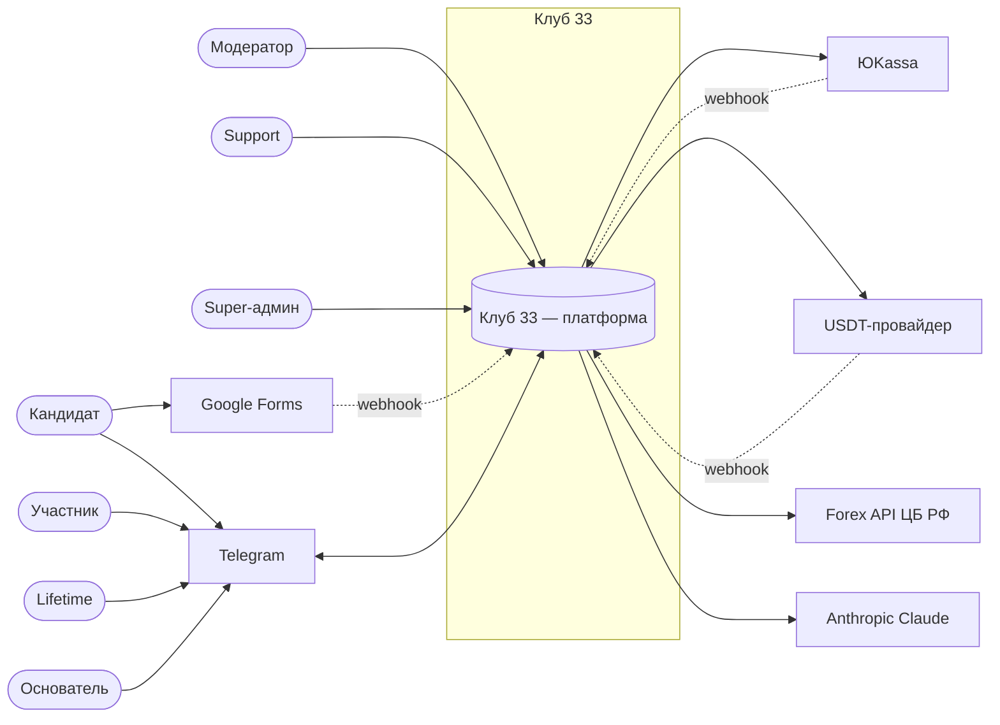
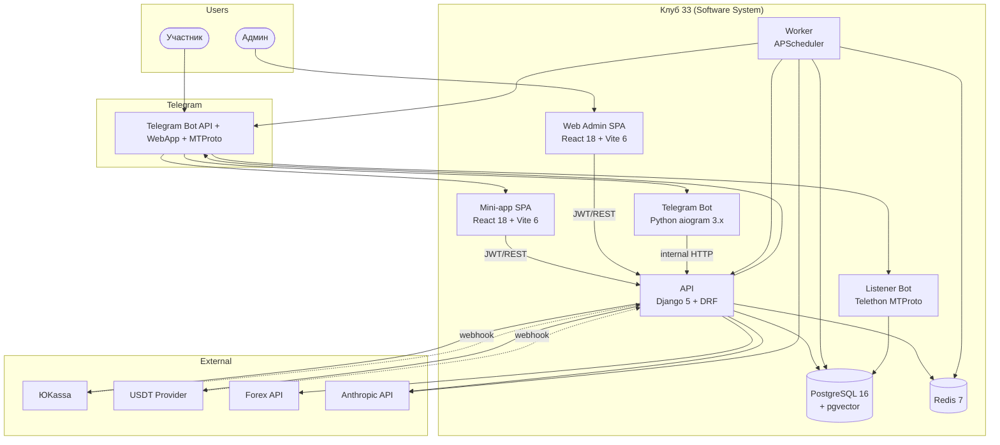
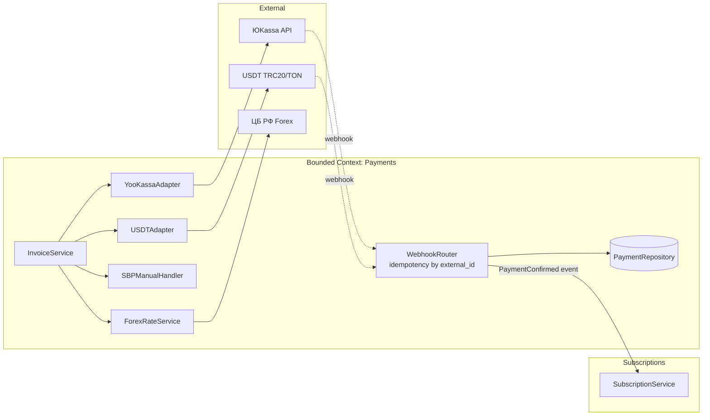
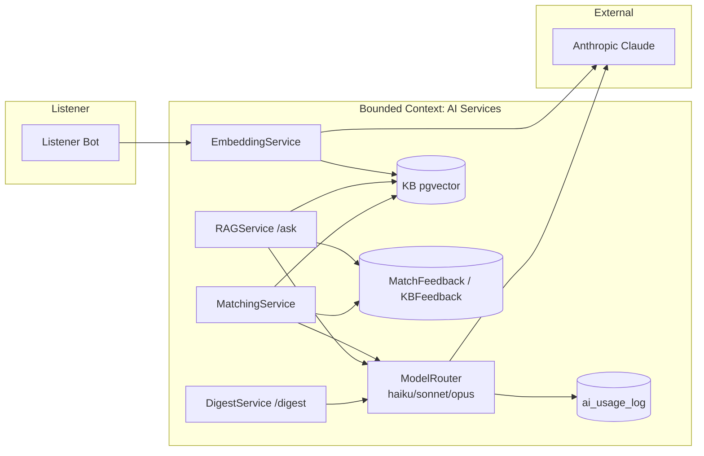
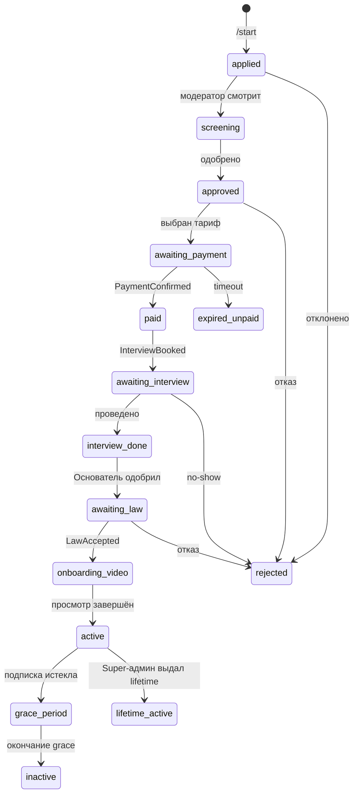
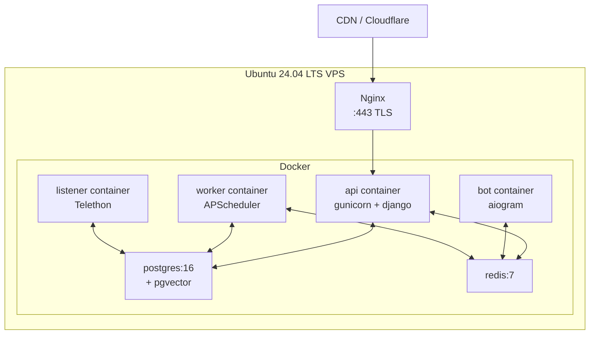

# C4 диаграммы «Клуба 33»

Источник истины — `workspace.dsl` (Structurizr DSL). Диаграммы ниже — Mermaid-эквиваленты для быстрого просмотра в Git.

---

## 1. System Context (C4 Level 1)

---

## 2. Container Diagram (C4 Level 2)

---

## 3. Component Diagram — Payments (C4 Level 3)

---

## 4. Component Diagram — AI Services (C4 Level 3)

---

## 5. Component Diagram — Access Control / FSM Bot (C4 Level 3)

14 состояний. Хранение: Redis (горячее) + persist в `users.fsm_state` (на случай рестарта Redis). См. ADR-007.

---

## 6. Deployment Diagram (упрощённый)

---

*Документ создан: Architect Agent | Дата: 2026-05-16*
