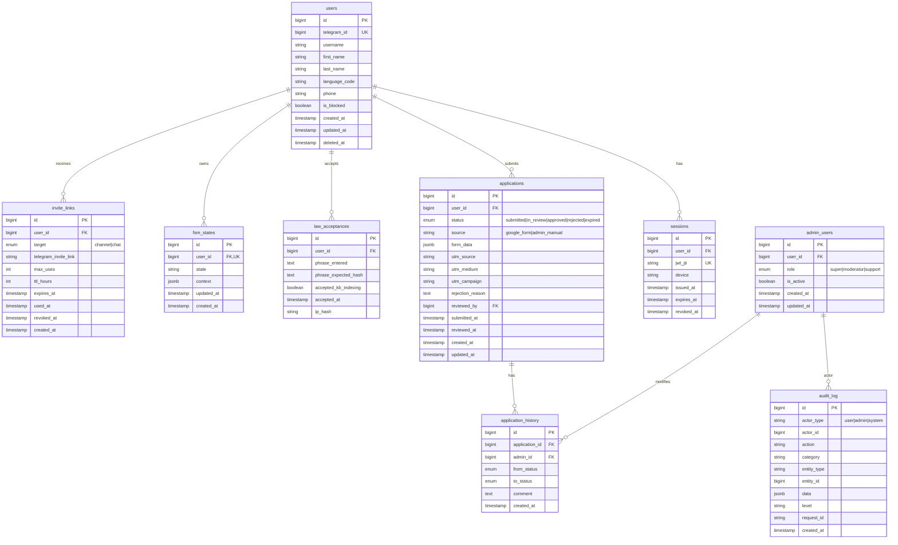
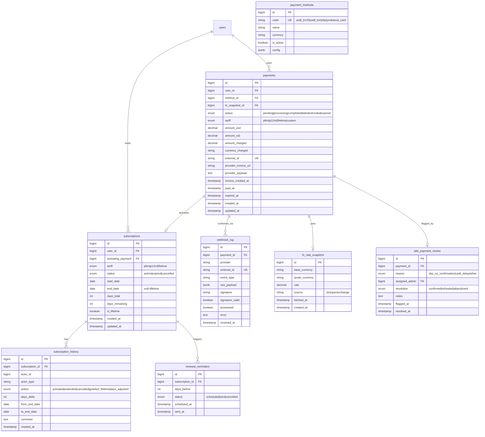
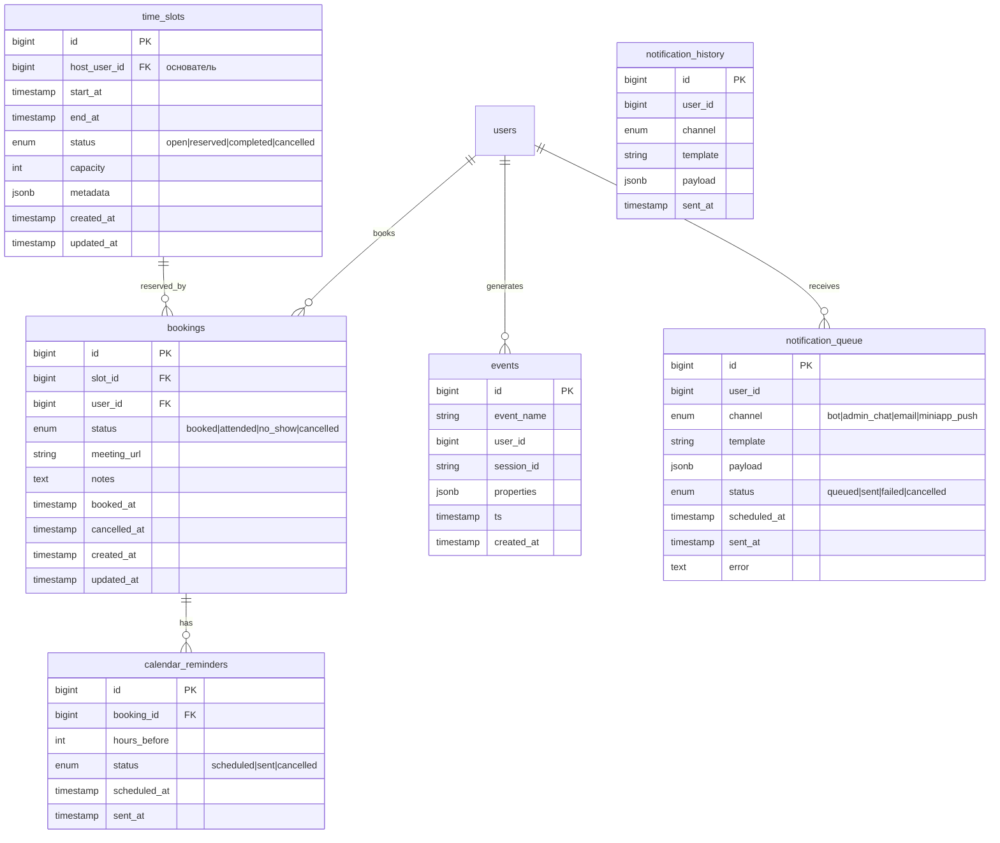
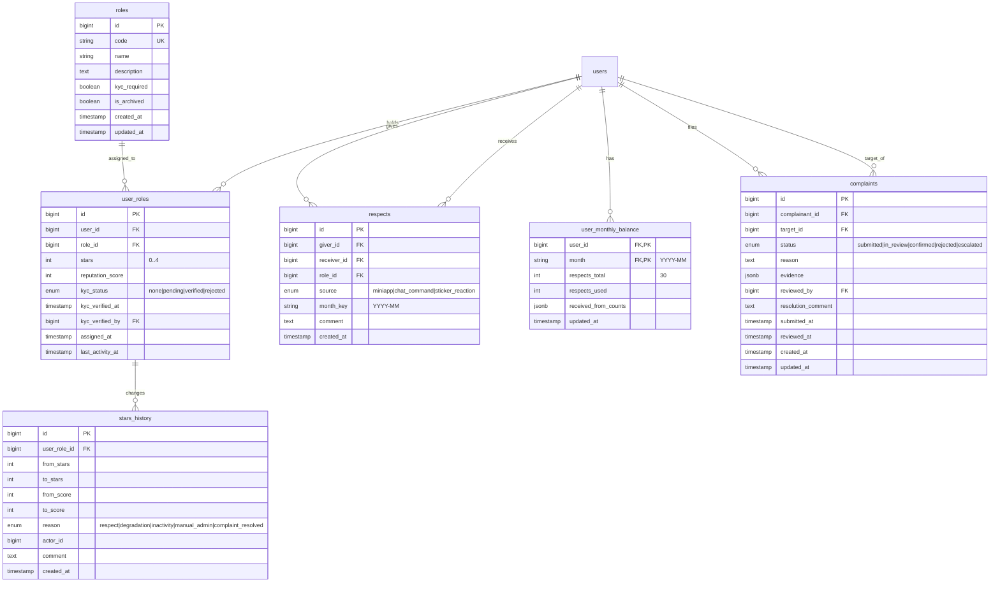
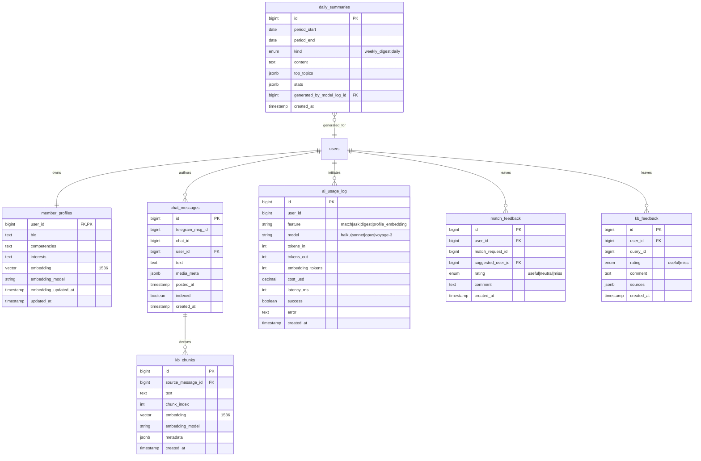
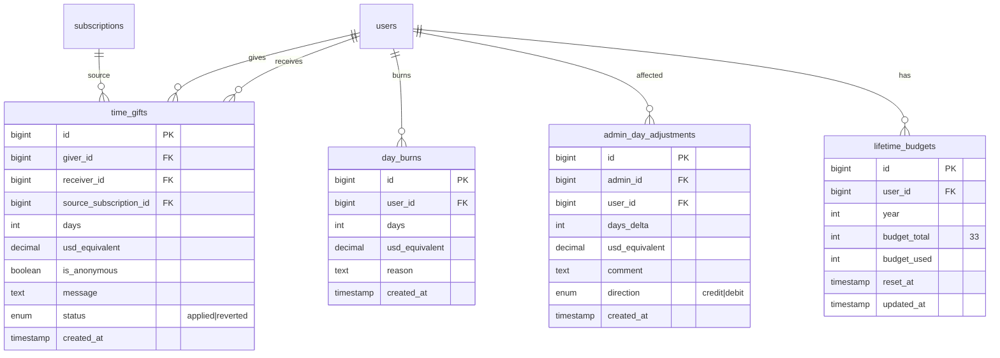

# ER-диаграмма — Клуб 33

> Полная модель данных для трёх фаз релиза. Группировка по bounded contexts из §23 ТЗ + расширения (events для воронки, fx_rate_snapshot, late_payment_review, calendar, AI feedback).
> СУБД: PostgreSQL 16 + pgvector (embeddings 1536 dim).

## Обзор bounded contexts

| Контекст | Таблицы | Фаза |
|---|---|---|
| Identity | users, sessions, admin_users, audit_log | 1 |
| Applications | applications, application_history | 1 |
| Payments | payments, payment_methods, fx_rate_snapshot, late_payment_review, webhook_log | 1 |
| Subscriptions | subscriptions, subscription_history, renewal_reminders | 1 |
| Access | invite_links, law_acceptances, fsm_states | 1 |
| Calendar | time_slots, bookings, calendar_reminders | 1 |
| Events | events | 1 |
| Notifications | notification_queue, notification_history | 1 |
| Social | roles, user_roles, respects, user_monthly_balance, complaints, stars_history | 2 |
| AI | member_profiles, chat_messages, kb_chunks, daily_summaries, ai_usage_log, match_feedback, kb_feedback | 2 |
| Time Economy | time_gifts, day_burns, admin_day_adjustments, lifetime_budgets | 3 |

---

## 1. Identity + Applications + Access (Phase 1)

---

## 2. Payments + Subscriptions (Phase 1)

---

## 3. Calendar + Events + Notifications (Phase 1)

---

## 4. Social (Phase 2)

---

## 5. AI (Phase 2)

---

## 6. Time Economy (Phase 3)

---

## Связи между контекстами

| Связь | Тип | Описание |
|---|---|---|
| applications.user_id → users.id | FK | Кандидат подаёт заявку |
| applications.reviewed_by → admin_users.id | FK | Модератор рассматривает |
| payments.fx_snapshot_id → fx_rate_snapshot.id | FK | Курс зафиксирован при инвойсе |
| payments → subscriptions | one-to-one (activating) | Успешная оплата = активация |
| subscriptions.activating_payment → payments.id | FK | Источник подписки |
| time_gifts.source_subscription_id → subscriptions.id | FK | Из чьей подписки взяты дни |
| respects → user_monthly_balance | счётчик | Контроль 30/мес и 3 на получателя |
| chat_messages → kb_chunks | one-to-many | Индексация для RAG |
| webhook_log.external_id | UNIQUE | Идемпотентность |
| events.event_name + ts | партиционирование по месяцу | Аналитика воронки |

---

*Документ создан: Data Agent | Дата: 2026-05-16*
