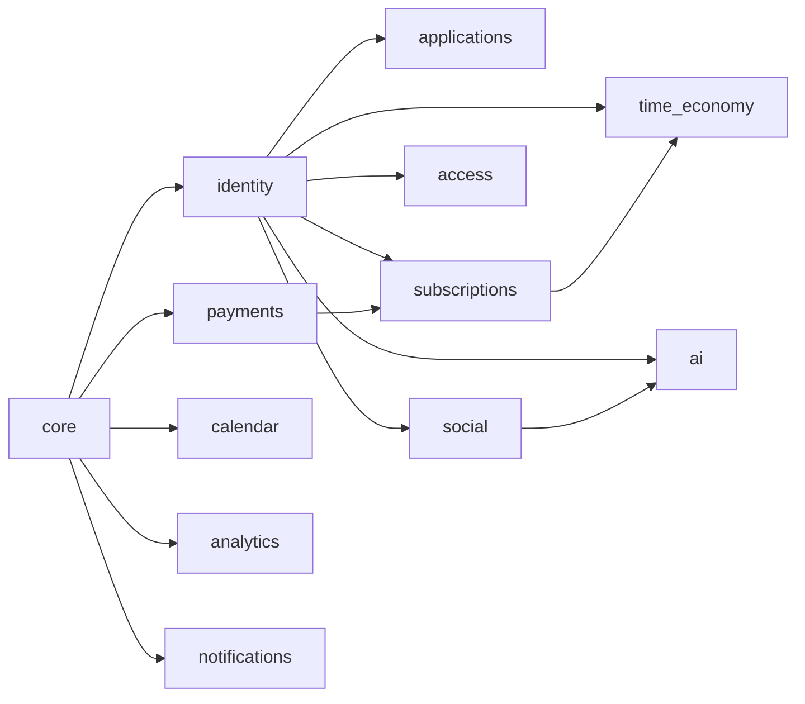

# План миграций — Клуб 33

> Последовательность Django миграций по фазам. Каждая миграция атомарна, обратима (downgrade), с явными зависимостями. Идентификатор: `{phase}_{NNNN}_{app}_{name}`.

## Общие требования

- ORM: Django 5 migrations.
- Расширения PostgreSQL: `CREATE EXTENSION IF NOT EXISTS pgcrypto;`, `vector;`, `btree_gin;` — миграция `0001_extensions` в core.
- Триггер `set_updated_at()` — общий, создаётся в core (`0002_common_triggers`).
- pg_partman устанавливается на инфра-уровне (DevOps), Django миграция создаёт parent-таблицы и initial partitions.
- Все миграции зафиксированы в `git`, накатываются через `manage.py migrate`.

---

## Phase 0: Bootstrap

| # | Миграция | App | Описание |
|---|---|---|---|
| 0001 | `0001_extensions` | core | `CREATE EXTENSION pgcrypto, vector, btree_gin, pg_trgm` |
| 0002 | `0002_common_triggers` | core | Функция `set_updated_at()`, базовый AuditLog |

---

## Phase 1: Базовый бот (релиз 1)

### Identity
| # | Миграция | App | Зависимости |
|---|---|---|---|
| P1-01 | `0001_users` | identity | core/0001 |
| P1-02 | `0002_sessions` | identity | identity/0001 |
| P1-03 | `0003_admin_users` | identity | identity/0001 |
| P1-04 | `0004_audit_log` | identity | core/0001 |

### Applications
| # | Миграция | App | Зависимости |
|---|---|---|---|
| P1-05 | `0001_applications` | applications | identity/0001 |
| P1-06 | `0002_application_history` | applications | applications/0001, identity/0003 |

### Payments
| # | Миграция | App | Зависимости |
|---|---|---|---|
| P1-07 | `0001_payment_methods` | payments | core/0001 |
| P1-07a | `0001_seed_payment_methods` (data) | payments | P1-07 — seed: usdt_trc20, usdt_ton, sbp, yookassa_card |
| P1-08 | `0002_fx_rate_snapshot` | payments | P1-07 |
| P1-09 | `0003_payments` | payments | P1-07, P1-08, identity/0001 |
| P1-10 | `0004_webhook_log` | payments | P1-09 |
| P1-11 | `0005_late_payment_review` | payments | P1-09, identity/0003 |

### Subscriptions
| # | Миграция | App | Зависимости |
|---|---|---|---|
| P1-12 | `0001_subscriptions` | subscriptions | identity/0001, payments/0003 |
| P1-13 | `0002_subscription_history` | subscriptions | P1-12 |
| P1-14 | `0003_renewal_reminders` | subscriptions | P1-12 |

### Access
| # | Миграция | App | Зависимости |
|---|---|---|---|
| P1-15 | `0001_invite_links` | access | identity/0001 |
| P1-16 | `0002_law_acceptances` | access | identity/0001 |
| P1-17 | `0003_fsm_states` | access | identity/0001 |

### Calendar
| # | Миграция | App | Зависимости |
|---|---|---|---|
| P1-18 | `0001_time_slots` | calendar | identity/0001 |
| P1-19 | `0002_bookings` | calendar | P1-18 |
| P1-20 | `0003_calendar_reminders` | calendar | P1-19 |

### Events (партиционированная)
| # | Миграция | App | Зависимости |
|---|---|---|---|
| P1-21 | `0001_events_parent` | analytics | core/0001 — CREATE TABLE events PARTITION BY RANGE (ts) |
| P1-22 | `0002_events_initial_partitions` | analytics | P1-21 — создание партиций events_2026_05..events_2026_12 |
| P1-22a | `0003_events_pg_partman_setup` (raw SQL) | analytics | P1-22 — настройка pg_partman для авто-создания будущих партиций |

### Notifications
| # | Миграция | App | Зависимости |
|---|---|---|---|
| P1-23 | `0001_notification_queue` | notifications | core/0001 |
| P1-24 | `0002_notification_history` | notifications | core/0001 |

### Бэкфилл (Phase 1)
- Нет — все данные генерируются с нуля.
- Seed: `payment_methods` (4 строки), `roles` пустые (Phase 2).

---

## Phase 2: Социальный слой + AI

### Social
| # | Миграция | App | Зависимости |
|---|---|---|---|
| P2-01 | `0001_roles` | social | core/0001 |
| P2-02 | `0002_user_roles` | social | P2-01, identity/0001 |
| P2-03 | `0003_respects` | social | P2-02 |
| P2-04 | `0004_user_monthly_balance` | social | identity/0001 |
| P2-05 | `0005_complaints` | social | identity/0001, identity/0003 |
| P2-06 | `0006_stars_history` | social | P2-02 |

### AI
| # | Миграция | App | Зависимости |
|---|---|---|---|
| P2-07 | `0001_member_profiles` | ai | identity/0001 + pgvector |
| P2-08 | `0001_member_profiles_index` (raw SQL) | ai | P2-07 — `CREATE INDEX ... USING ivfflat (embedding vector_cosine_ops) WITH (lists=100)` |
| P2-09 | `0002_chat_messages_parent` | ai | identity/0001 — PARTITION BY RANGE (posted_at) |
| P2-10 | `0003_chat_messages_initial_partitions` | ai | P2-09 |
| P2-11 | `0004_kb_chunks` | ai | P2-09 + pgvector |
| P2-11a | `0005_kb_chunks_hnsw_index` (raw SQL) | ai | P2-11 — HNSW index |
| P2-12 | `0006_daily_summaries` | ai | core/0001 |
| P2-13 | `0007_ai_usage_log` | ai | identity/0001 |
| P2-14 | `0008_match_feedback` | ai | identity/0001, P2-13 |
| P2-15 | `0009_kb_feedback` | ai | identity/0001, P2-13 |

### Бэкфилл (Phase 2)
- `user_monthly_balance`: при первом обращении пользователя в текущем месяце — лениво инициализируется записью `(user_id, YYYY-MM, 30, 0, {})`. Альтернатива — cron в первый день месяца на всех active subscribers.
- `member_profiles`: создаётся при первом редактировании bio в mini-app; embedding генерируется async после save.

---

## Phase 3: Экономика времени

| # | Миграция | App | Зависимости |
|---|---|---|---|
| P3-01 | `0001_time_gifts` | time_economy | identity/0001, subscriptions/0001 |
| P3-02 | `0002_day_burns` | time_economy | identity/0001 |
| P3-03 | `0003_admin_day_adjustments` | time_economy | identity/0001, identity/0003 |
| P3-04 | `0004_lifetime_budgets` | time_economy | identity/0001 |

### Бэкфилл (Phase 3)
- `lifetime_budgets`: при включении Phase 3 — однократный backfill для всех `subscriptions.is_lifetime=TRUE`:
  - `INSERT INTO lifetime_budgets (user_id, year, budget_total, budget_used, reset_at) SELECT user_id, EXTRACT(YEAR FROM CURRENT_DATE), 33, 0, '2027-01-01 00:00:00 Europe/Moscow' FROM subscriptions WHERE is_lifetime;`

---

## Ретенция и обслуживание

| Задача | Частота | Реализация |
|---|---|---|
| Создание новых партиций `events`, `chat_messages` | ежедневно | pg_partman maintenance |
| DROP старых партиций `events` (>12 мес) | ежемесячно | pg_partman retention |
| DROP старых партиций `chat_messages` | ежеквартально | оценка после Phase 2 — возможно дольше для RAG |
| Чистка `webhook_log` (>6 мес) | ежемесячно | APScheduler `cleanup_webhook_log` |
| Чистка `audit_log` (>24 мес) | ежемесячно | APScheduler `cleanup_audit_log` |
| Чистка `events` (если без партиций) | n/a | партиционирование заменяет |
| Чистка `notification_history` (>12 мес) | ежемесячно | APScheduler |
| Архивация `applications` со status='expired' (>6 мес) | ежеквартально | soft delete + архив |
| Сброс `user_monthly_balance` | 1 числа 00:00 МСК | APScheduler — создание записей на новый месяц |
| Сброс `lifetime_budgets` | 1 января 00:00 МСК | APScheduler |
| Обновление `subscriptions.days_remaining` | ежедневно | APScheduler |
| Истечение `invite_links` | ежечасно | APScheduler |

---

## Версионирование схемы

- Все миграции линейны внутри app; межапповые зависимости через `dependencies` в Django Migration.
- Обратные миграции (`Migration.backwards`) обязательны для всех структурных изменений.
- Data migrations (seed, backfill) — отдельные файлы, идемпотентны.
- `python manage.py spectacular --file docs/interface/openapi.yaml` обновляется в том же PR, что и API-изменения.

---

## Зависимости верхнего уровня

---

*Документ создан: Data Agent | Дата: 2026-05-16*
